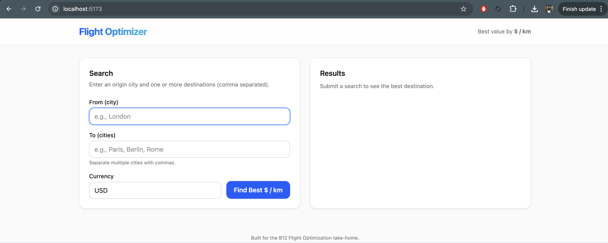

#  Flight Optimizer — B12 Full-Stack Take-Home

Find the **best-value flight destination** by comparing price per kilometer.

---
##  Demo



##  Features
- Fetches data from [Kiwi Tequila API](https://tequila.kiwi.com/portal/docs/tequila_api)
- CLI, REST API (FastAPI), and React web UI
- Responsive Tailwind design (dark-mode ready)
- Fully Dockerized for one-command setup

---

##  Structure
```
flight_optimizer/
├── config.py            # loads env & fallback key
├── helpers.py           # core flight logic
├── flight_optimizer.py  # CLI
├── server.py            # FastAPI /optimize endpoint
├── flight-ui/           # React + Vite + Tailwind
├── Dockerfile.api
├── Dockerfile.web
├── docker-compose.yml
└── nginx.conf
```

---

## 🪄 Run Locally (no Docker)

### Backend
```bash
pip install -r requirements.txt
uvicorn server:app --reload --port 8000
```
→ [http://localhost:8000/docs](http://localhost:8000/docs)

### Frontend
```bash
cd flight-ui
npm install
npm run dev
```
→ [http://localhost:5173](http://localhost:5173)

### CLI
```bash
python flight_optimizer.py --from "London" --to "Paris" "Berlin"
```

---

##  API Key
The assignment fallback key is rate-limited.  
Create a file `.env` in project root:
```
KIWI_API_KEY=your_real_tequila_key_here
DEFAULT_CURRENCY=USD
```

---

##  Run with Docker Compose
```bash
docker compose up --build
```

| Service | URL | Description |
|----------|-----|-------------|
| **api** | http://localhost:8000 | FastAPI backend |
| **web** | http://localhost:5173 | React frontend |

---

## Tests
```bash
pytest -q
```

---

##  Common Commands
| Action | Command |
|--------|----------|
| rebuild containers | `docker compose build --no-cache` |
| stop all | `docker compose down` |
| live logs | `docker compose logs -f` |
| exec into api | `docker compose exec api bash` |

---

##  Troubleshooting
| Problem | Fix |
|----------|-----|
| 403 Forbidden from Kiwi | Use your own `KIWI_API_KEY` |
| Frontend → API fails | set `VITE_API_BASE=http://localhost:8000` or proxy `/api` in nginx |
| `uvicorn` not found | ensure `fastapi` & `uvicorn` in requirements.txt |
| Rolldown errors | pin `vite@5` in `flight-ui` |

---

##  Design Highlights
- **helpers.py** – pure computation, easy to test  
- **server.py** – lightweight HTTP wrapper  
- **config.py** – env-driven configuration  
- **flight-ui** – clean Tailwind interface  
- **Docker Compose** – runs full stack in seconds  

---

